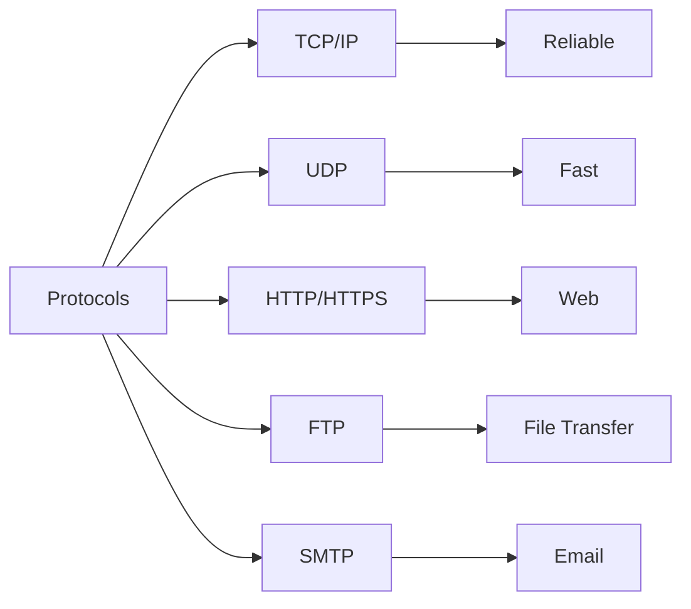

# Protocols

## What is a Protocols?

Protocols are set of rules defined by Internet Society

- TCP: Transmission Control Protocol
- UDP: User Datagram Protocol
- HTTPS: Hypertext Transfer Protocol Secure
- HTTP: Hypertext Transfer Protocol
- FTP: File Transfer Protocol
- SMTP: Simple Mail Transfer Protocol

## HTTP

HTTP is a client server protocol which tells us how we make a request to the server and how the server responds back.It is used in web pages which uses port 80.HTTP uses TCP.It is a stateless protocol

## UDP 
 It is a connectionless protocol and does not mainatin the state and data may be loss in this protocol
