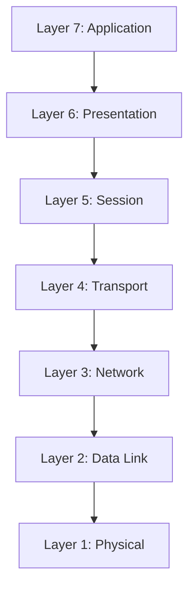

# OSI Model

## What is OSI Model?

The OSI (Open Systems Interconnection) Model is a conceptual framework created by the International Organization for Standardization (ISO) to describe how data is transmitted across a network using a structured seven-layer architecture.

## Layers of OSI Model 

OSI model uses a seven steps for transmitting or sharing data or files between two computers. Those layers are ,

### Application Layer 

Application layer refers the software applications we use like Whatsapp, Instagaram etc..

### Presentation Layer 

Presentation Layer receives the data from the application layer and converts it into meachine representable binary code .It act as a translator.It protects data by encoding at the sender side and decode it at the recevier end. It compress the data to speedup transfer times 
 
### Session Layer 

Session Layer establishes, manages,Authorization, synchronizes, and terminates communication sessions between applications on different devices

### Transport layer

 The data recevied from the session layer is divided into small data units called segments. Every segments contains the destination port number and a sequence number which helps to reasamble the segments in correct order. It contains a checksum which checks the data recevied is safe or not .

### Network Layer

* Logical Addressing: Assigns unique IP addresses to senders and receivers so they can be identified across the internet.
* Routing: Finds the best path for data to travel through multiple routers and networks.
* Forwarding: Moves incoming packets to the correct output interface on a router. 
* Fragmentation: Breaks large data packets into smaller pieces if the network path requires it

### Datalink Layer

Datalink layer basically allows us to directly communicate betweeen the computers and the hosts. It receives the data packets from the network layer and these packets contains the IP adresses from sender and the receiver

* Framing: Encapsulates packets from the network layer into discrete frames by adding a header and trailer.
* Physical Addressing: Uses unique MAC (Media Access Control) addresses in frame headers to identify source and destination devices on the same network segment.

### Physical Layer

Bit Transmission: Converts digital data into electrical, optical, or radio frequency signals for transmission over a medium.
Hardware Definition: Specifies cables, connectors, voltage levels, and pin layouts.
Synchronization: Provides clock signals to keep the sender and receiver in sync regarding bit timing.