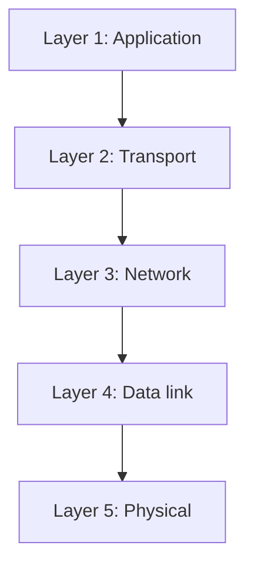

# TCP/IP Model

It contains only 5 layers 

```mermaid
graph TD
    L1["Layer 1: Application"]
    L1 --> L2["Layer 2: Transport"]
    L2 --> L3["Layer 3: Network"]
    L3 --> L4["Layer 4: Data link"]
    L4 --> L5["Layer 5: Physical"]

```