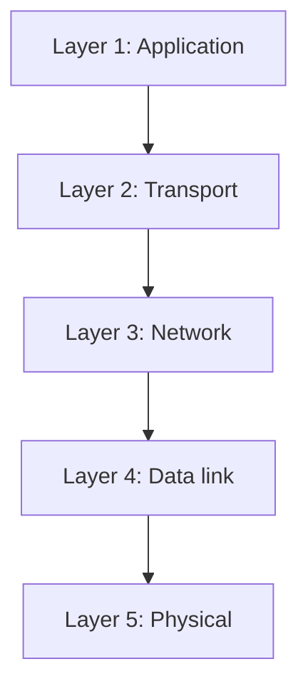
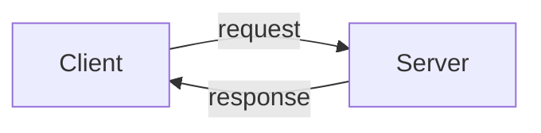

# TCP/IP Model

It contains only 5 layers 

## Application Layer

This is where users mostly interact with it like using browser, texting in whatsapp etc .. which lies in our devices. HTTP is used in this layer

## Transport Layer

TCP is used in Transport layer