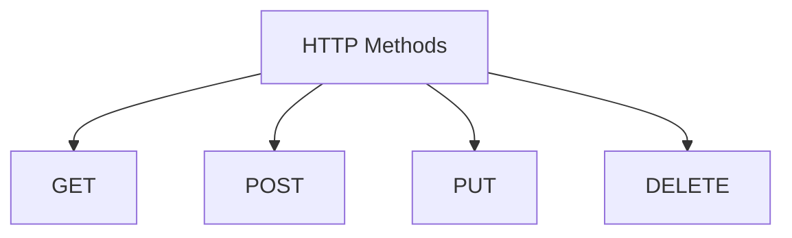

# HTTP Methods

## What is a HTTP Method?

A method is a process of telling the sever what to do

```mermaid
flowchart TD
    A[ HTTP Methods]
    
    A --> D[GET]
    A --> E[POST]
    A --> F[PUT]
     A --> G[DELETE]

```
