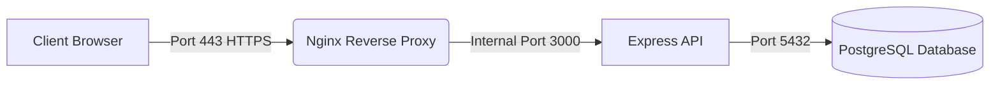
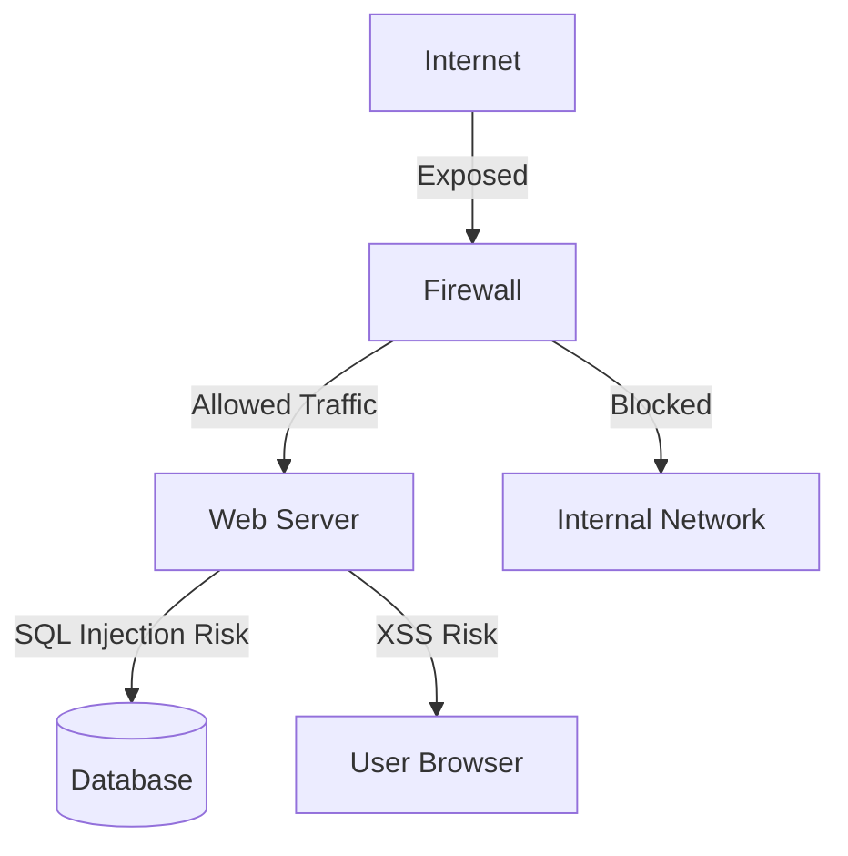

# Internet 

## What is Internet ?

Internet is a collection of computers interconnected to each other for sharing data on global stage is called Internet

## Define Computer ?

COMPUTER : Commonly Oriented Meachine Particularly For Training Education And Research

---

## Example: Web Request Flow

This shows how a request travels from a browser to a database through a reverse proxy.

**What this means:**
- `User` → sends an HTTPS request on port 443
- `Proxy` (Nginx) → receives it and forwards internally to the app on port 3000
- `App` (Express) → handles the logic and talks to the database on port 5432
- `DB` (PostgreSQL) → stores/returns the data

---

## Example: Attack Surface Diagram

**Key terms:**
- **Attack Surface** — every point where an attacker could try to get in
- **SQL Injection** — attacker sends malicious SQL through a form or URL
- **XSS (Cross-Site Scripting)** — attacker injects scripts that run in the victim's browser
