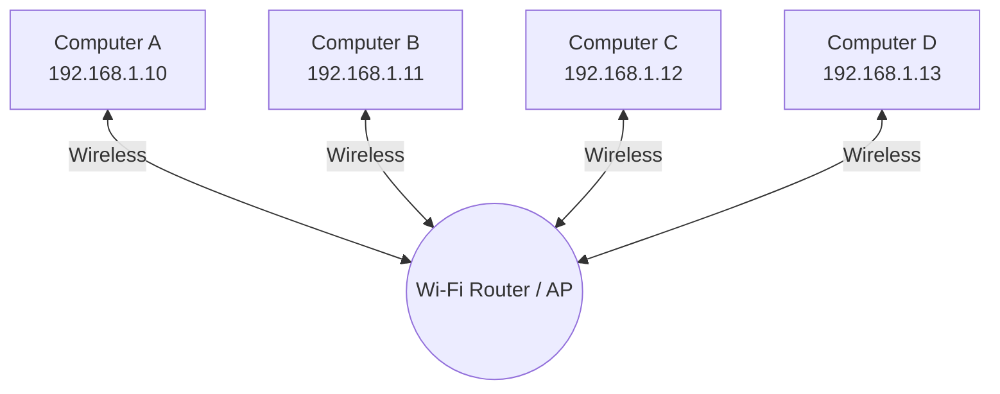
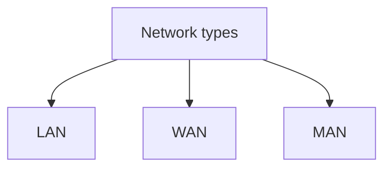

# Internet 

## What is Internet ?

Internet is a collection of computers interconnected to each other for sharing data on global stage via IP addresses. It connects different countries or places in two ways which are,
* Physically : using Optical fibre cables and coaxil cables
* Wireless: bluetooth,wifi,3G,4G,5G,LTE can used for short range (Until reaching the tower, it's wireless; after the tower, it's wired) 




### file sizes
  It defines the speed of uploading and downloading files in computers

* 1 Kbps :1000 bits/s
* 1 Mbps : 1000,000  bits/s
* 1 Gbps :10^9 bits/s

### Types of network

* LAN: Local area Network (For small house or office)
eg:Wifi,Ethernet
* WAN: Wide area Network (Across countries)
eg:Optical fibre cables,SONET,Frame relay connects local area network with wide area network
* MAN: Metropolitan Area Network (Across the city)




## Define Computer ?

COMPUTER : Commonly Oriented Meachine Particularly For Training Education And Research

## IP Address ?

An IP Address is a unique id assigned to each device connected to the computer network which used Internet Protocol for communication.

   ```mermaid
flowchart TD
    A[ISP Internet service provider] -->|WIFI Connection| B(Modem/Router)
    
    B-->|Local IP 1| D[Device 1]
    B -->|Local IP 2| E[Device 2]
    B -->|Local IP 3| F[Device 3]

    
### Modem

Modem is used to convert digital signals into analog signals and vice versa 

### Router

Router is a device that redirects the packets to its designated IP Adresses
   ```
## Port number

An IP adress is used to find the location of the device ,Meanwhile port number is used to find the which application in the device you are using. Ports are 16 bit numbers which is 2^16

* Ports 0 to 1023 :reserved ports
* Ports 1024 to 49152 : Reserved for specific applications
* remaining ports:for our use
---


