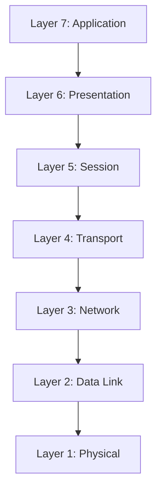

# OSI Model

## What is OSI Model?

The OSI (Open Systems Interconnection) Model is a conceptual framework created by the International Organization for Standardization (ISO) to describe how data is transmitted across a network using a structured seven-layer architecture.

## Layers of OSI Model 

OSI model uses a seven steps for transmitting or sharing data or files between two computers. Those layers are ,

### Application Layer 

Application layer refers the software applications we use like Whatsapp, Instagaram etc..

### Presentation Layer 

Presentation Layer receives the data from the application layer and converts it into meachine representable code
 