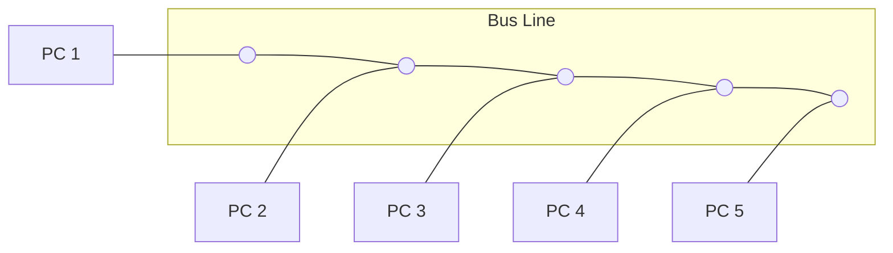

# Topologies

## Bus Topology

Bus Topology is a type in which the systems are connected in a single cable . It is a less complex topology mainly used in labs,schools etc..

```mermaid
graph LR
    %% Bus Topology Diagram
    %% LR = Left to Right layout

    subgraph Bus[Bus Line]
        B1(( )) --- B2(( )) --- B3(( )) --- B4(( )) --- B5(( ))
    end

    %% Devices connected to the bus
    PC1[PC 1] --- B1
    PC2[PC 2] --- B2
    PC3[PC 3] --- B3
    PC4[PC 4] --- B4
    PC5[PC 5] --- B5

```