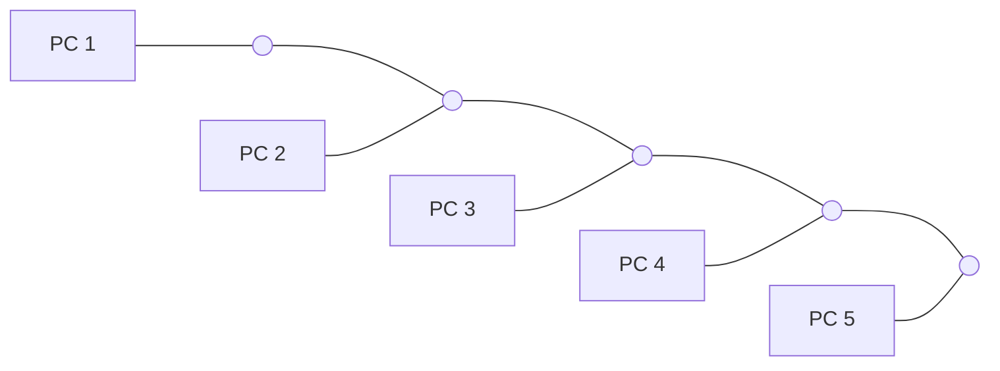
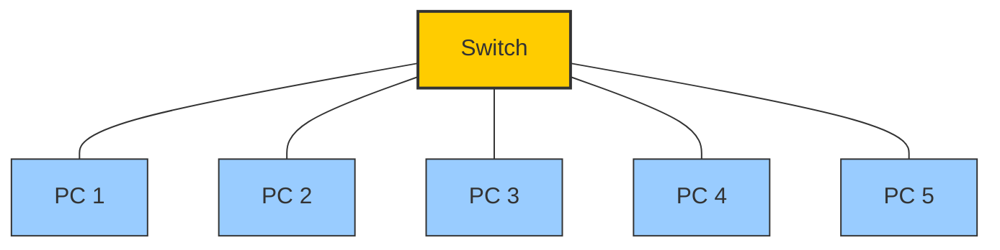

# Topologies

## Bus Topology

Bus Topology is a type in which the systems are connected in a single cable . It is a less complex topology mainly used in labs,schools etc..

## Star Topology

Star Topology is a network setup in which each device is connected to a central node called a hub. The hub manages the data flow between the devices. If one device wants to send data to another device, it has to first send the information to the hub, and then the hub transmits that data to the required device.

