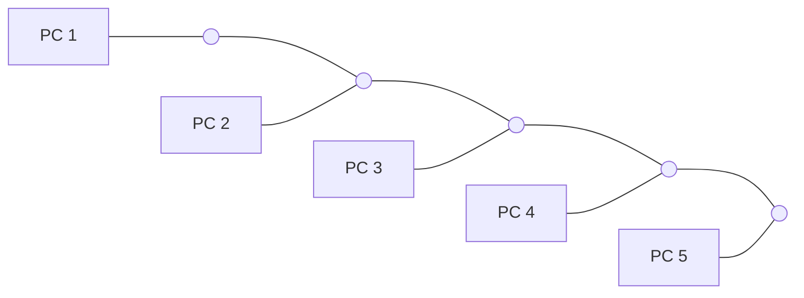
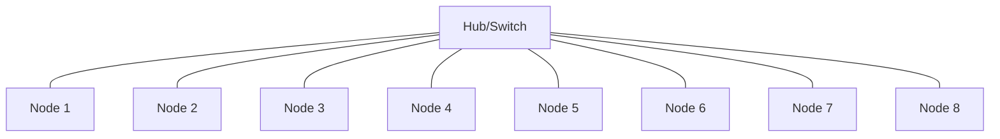

# Topologies

## Bus Topology

Bus Topology is a type in which the systems are connected in a single cable . It is a less complex topology mainly used in labs,schools etc..



## Star Topology

Star Topology is a network setup in which each device is connected to a central node called a hub. The hub manages the data flow between the devices. If one device wants to send data to another device, it has to first send the information to the hub, and then the hub transmits that data to the required device.




## Mesh Topology

In mesh topology every computer in the network is connected to each other. It is a bit expensive so much wires are need to be used. If you want to add a new computer to the network you need to to connect it with all other systems in the network 


```mermaid
graph TD
   
        N1(Node 1) --- N2(Node 2)
        N1 --- N3(Node 3)
        N1 --- N4(Node 4)
        
        N2 --- N3
        N2 --- N4
        
        N3 --- N4
    end

    
```
    
  